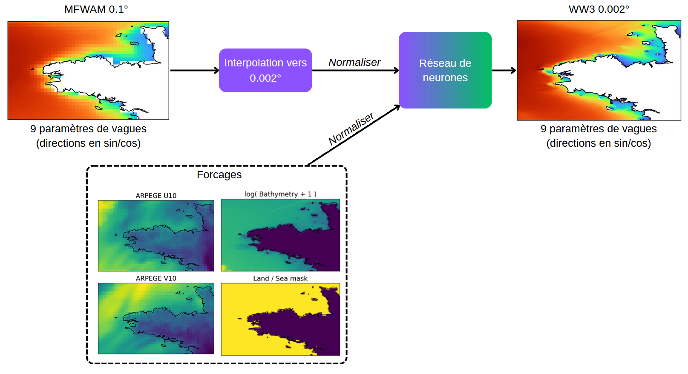
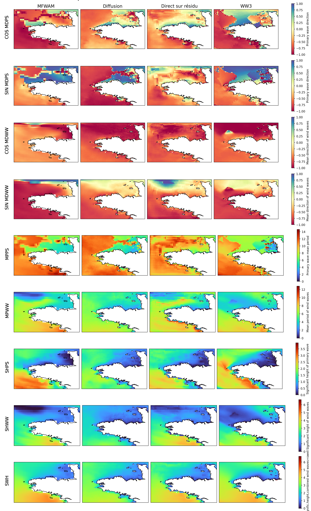

# WW3

Le projet consiste à faire du downscaling des prévisions de MFWAM forcées par ARPEGE (10km) vers l’analyse WW3 forcée par ARPEGE (200m) sur 7 paramètres de vagues (hauteur, direction, période):

- MDPS: Primary wave direction. (degree true)
- MDWW: Mean direction of wind waves. (degree true)
- MPPS: Primary wave mean period. (s)
- MPWW: Mean period of wind waves. (s)
- SHPS: Significant height of primary wave. (m)
- SHWW: Significant height of wind waves. (m)
- SWH: Significant height combined wind waves + swell. (m)

Sur 5 grilles:

- BRETAGNE0002
- CORSE0002
- MANCHE0002
- GASCOGNE0002
- LIONAZUR0002

On choisit, de faire un entrainement différent pour chaque grille.

## Entrées / Sorties du modèle

Forcings:  7 paramètres de vagues MFWAM interpolées à sur une grille à 200m par pas de 1h de 0h à 48h puis par pas de 3h jusqu'à +102h (en prévision).

Input/Output: 7 paramètres de vagues WW3 en analyse.


En ajoutant l'option `training_strategy = downscaling` dans le trainer, le modèle prévoit l'état au temps t (à l'échelle ww3) en prenant en entrée les forcings et ne prenant pas en compte les inputs.

Dans la stratégie autoregressive, le modèle ajoute en input les états des paramètres de vagues au temps précèdents (t-1 si le nombre d'inputs step est de 1).


Ci-dessous un schéma représentant les entrées et sortie du modèle.




## Repository Structure

```
ww3
└─── bin
│   └─── 1_1_download_obs.py        # téléchargement des données satellite depuis Copernicus
│   └─── 1_download.py        # téléchargement des données depuis la BDAP
│   └─── 2_write_metadata.py
│   └─── 3_convert_to_zarr.py         # conversion vers zarr
│   └─── 4_compute_stats.py         # cli sur le dataset (calcul/affichage stats, test vitesse)
|   └─── main.py
└─── config                   # fichiers de config pour l'entrainement
|   └─── base_config.yaml
└─── ww3
|   └─── data               # contient des fonctions utiles sur les données
│   └─── dataset.py
│   └─── datamodule.py
│   └─── metrics.py          # Définition des métriques utiles à l'entrainement
│   └─── plots.py          # Définition des fonction de visualisation
│   └─── sample.py          # Définition d'une classe Sample permettant de gérer les données pour l'entrainement
│   └─── transforms.py          # Définition des transformation utilisable à l'entrainement
│   └─── settings.py
└─── Dockerfile
```
## Sorties du modèle

Ci-dessous un exemple de sortie des modèles de diffusion et direct.
On a 9 paramètres de vagues car on utilise les fonctions trigonométriques cos et sin pour les 2 directions moyennes.



# Usage

Veillez à changer le chemin `SCRATCH_PATH` dans le fichier `ww3/settings.py` pour modifier le chemin de sauvegarde.

## Pré-traitement

**1 - Télécharger les données**
Le téléchargement des données n'est pas disponible au grand public.

les fichiers gribs sont téléchargés au chemin :
```
SCRATCH_PATH / ww3   / BRETAGNE0002 / grib / 
                     / CORSE0002 / grib /
             / mfwam / BRETAGNE0002 / grib /
                     / CORSE0002 / grib /
             / arpege / BRETAGNE0002 / grib /
                     / CORSE0002 / grib /
```

Une description des données obtenue est décrite dans la figure ci-dessous:  


**1.1 - Observation**
Visualiser les observations par satellites disponibles [ici](https://data.marine.copernicus.eu/viewer/expert)

Il faut au préalable se créer un compte Copernicus.  

Pour télécharger les données du satellites jason3 sur le jeu de données de test:
```bash
python bin/1_1_download_obs.py
```

**2 - Ecrire le fichier de matadata**
```bash
python bin/2_write_metadata.py
```
à faire si une modification des données a été faite. (ex : ajout/suppression d'un paramètre, ajout/suppression d'une grille...)

**3 - Convertion de grib vers zarr**
Covertir les données en zarr permet une lecture plus rapide que en grib.
```bash
python bin/3_convert_to_zarr.py ww3 mfwam arpege 2023010100 2024010100 --area CORSE0002 BRETAGNE0002
```

**Afficher un grib**
```bash
python ww3/data/show_grib.py path_to_grib
```

**4 - Calculer les statistiques**
```bash
python bin/4_compute_stats.py --num_workers NUM_WORKERS
```
Calcul des min/max de chaque variable. Nos données comportent des nans, les statistiques sont calculé en les ignorant.

**5 - Pré-enregistrer le dataset**
```bash
python bin/5_prepare_dataset.py --downscaling_stride DOWNSCALING_STRIDE --workers WORKERS
```
Pré-enregistre le dataset au format NPZ, avec le bon downscaling stride. Ainsi les données sont enregistrées à la bonne taille et le chargement sera plus rapide pendant l'entraînement.

## Entrainement

**1 - Definir les configuration**
Pour configurer l'entrainement, il faut modifier le fichier dans le dossier config (dataset, model, trainer).

**2 - Lancer entrainement**

```bash
python bin/main.py fit --config config/basic.yaml
```

pour visualiser sur le tensorboard :
```bash
tensorboard --logdirs monorepo4ai/projects/ww3/logs
```