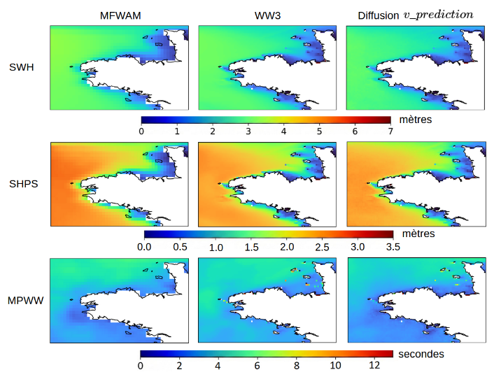
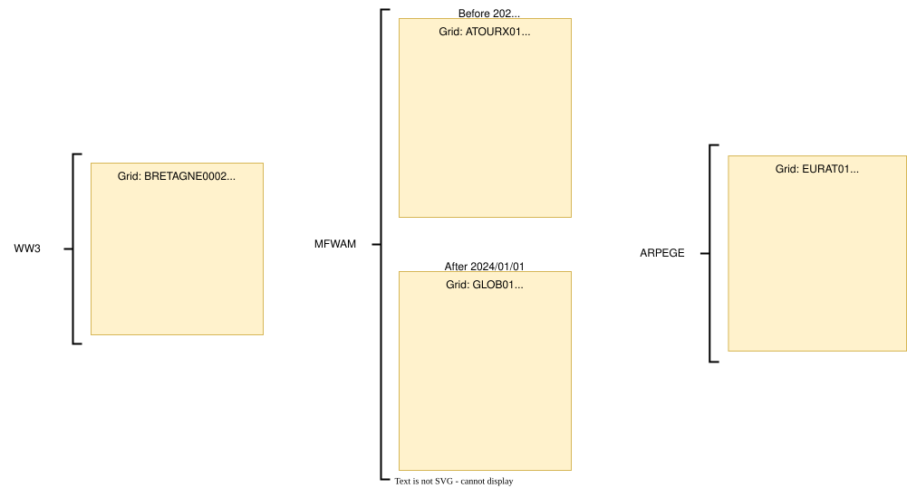
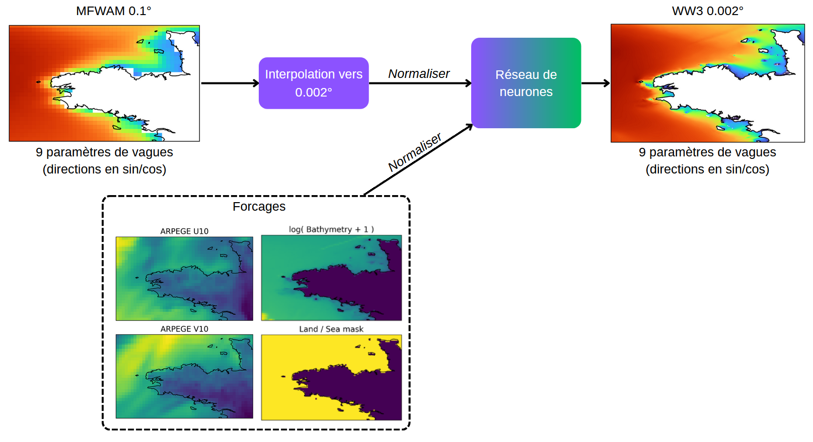
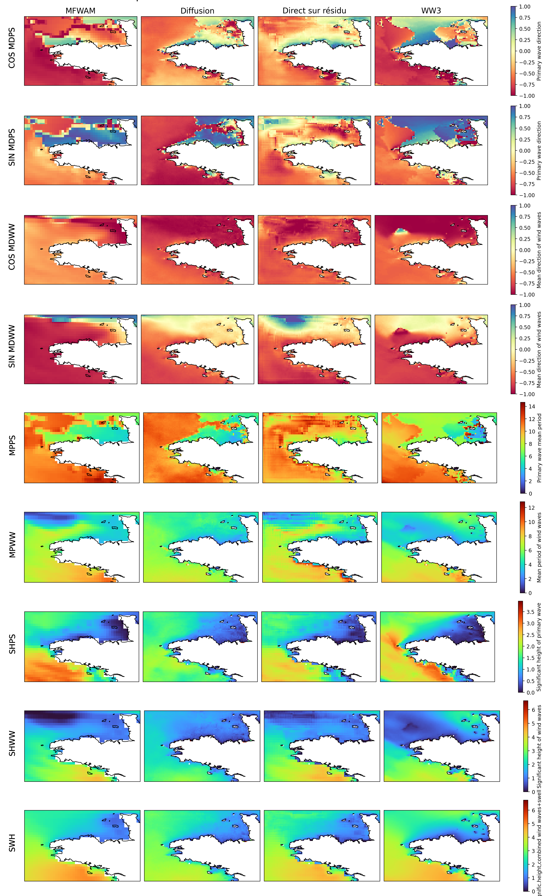

# Wave Downscaling

## Description
The project consists of **downscaling a wave forecasting model** from resolution 10km to 5km using Deep Learning. 

More precisely, we downscale ARPEGE‑forced MFWAM forecasts (10 km resolution) to ARPEGE‑forced WW3 analyses (200 m resolution degraded to 5km) for seven wave parameters: height, direction and period of swell and wind waves + height of combined wind waves and swell.
The work is carried out on the Britany domain.

Detailed description of the deep learning experiments and their results can be found in [this report](Internship_report_Mathilde_Ferreira.pdf) (French).



- [Install instructions](#install-instructions)
- [Usage](#usage)
- [Methodology](#methodology)
- [Repository Structure](#repository-structure)

---

## Install instructions

```sh
git clone https://github.com/meteofrance/cams-dl-ensemble.git
cd cams-dl-ensemble
```

### Using uv
```sh
uv sync
```
> Using uv, the subsequent usage commands should be run with
> `uv run <file.py>` instead of `python <file.py>`

### Using pip
Check that you are using a version of python >= 3.12.
```sh
python -m venv .venv
source .venv/bin/activate  # On windows: .venv/Script/Activate.ps1
pip install .
```

### Using runai (at Meteo-France)
```sh
runai build
```
> Using runai, the subsequent usage commands should be run with
> `runai python <file.py>` instead of `python <file.py>`

---

## Usage
Remember to change the `SCRATCH_PATH` variable in `ww3/settings.py` to the location where you want to store the data.

### Preprocessing

**1 – Download the data**

The data download is not publicly available.  
GRIB files are stored under the following directory tree:

```
SCRATCH_PATH / ww3   / BRETAGNE0002 / grib / 
             / mfwam / BRETAGNE0002 / grib /
             / arpege / BRETAGNE0002 / grib /
```

A description of the data layout is shown below:  


**1.1 – Download Satellite Observations**

You can visualise the satellite observations [here](https://data.marine.copernicus.eu/viewer/expert).  
You must first create a Copernicus account.

To download Jason‑3 satellite data for the test dataset, run:

```bash
python bin/1_1_download_obs.py
```

**2 - Write the metadata file**
```bash
python bin/2_write_metadata.py
```
Run this again whenever the raw data change (e.g., adding/removing a parameter or a grid).

**3 - Convert GRIB to Zarr**

Converting the data to Zarr enables much faster reads than GRIB.
```bash
python bin/3_convert_to_zarr.py ww3 mfwam arpege 2023010100 2024010100 --area CORSE0002 BRETAGNE0002
```

**Show a GRIB file**
```bash
python ww3/data/show_grib.py path_to_grib
```

**4 - Compute statistics**
```bash
python bin/4_compute_stats.py --num_workers NUM_WORKERS
```
This computes the min/max of each variable. Since the data contain NaNs, the statistics are calculated while ignoring them.

**5 - Pre‑prepare the dataset**
```bash
python bin/5_prepare_dataset.py --downscaling_stride DOWNSCALING_STRIDE --workers WORKERS
```
The command pre‑stores the dataset in NPZ format with the correct down‑scaling stride, so the data are saved at the proper size and loading will be faster during training.

## Training

**1 - Define the configuration**

Edit the YAML files in the config folder (dataset, model, trainer) to set the desired training parameters.

**2 - Launch training**

```bash
python bin/main.py fit --config config/basic.yaml
```

To monitor the training with TensorBoard:
```bash
tensorboard --logdirs monorepo4ai/projects/ww3/logs
```

## Methodology

### Deep Learning approches

During this project, we have tried several approaches:

| Name  | Description | Links to configuration and corresponding lightning module |
|---|---|---|
| Direct Supervised Training | The model is directly trained with a MSE loss to predict the target. **f(x) = y**  | [Lightning module](https://github.com/meteofrance/wave-downscaling/blob/main/ww3/plmodules/directplmodule.py)  |
| Residual Supervised Training | The model is trained with a MSE loss to predict the difference between the input and the target. **f(x) = y - x**| [Lightning module](https://github.com/meteofrance/wave-downscaling/blob/main/ww3/plmodules/directplmodule.py), [configuration](https://github.com/meteofrance/wave-downscaling/blob/main/config/unetrpp_mse.yaml)  |
| Residual Supervised Training with custom | Similar to the previous experiment but we replace the MSE loss with a Perceptual Loss or a combination of MSE and Perceptual loss. |   |
| Diffusion Training | The model is trained with a conditional diffusion method, heavily inspired from [Pytorch Lightning's Diffusion Tutorial](https://lightning.ai/lightning-ai/environments/train-a-diffusion-model-with-pytorch-lightning?section=featured). The model predicts the target. | [Lightning module](https://github.com/meteofrance/wave-downscaling/blob/main/ww3/plmodules/diffusionplmodule.py), [configuration](https://github.com/meteofrance/wave-downscaling/blob/main/config/diffusion.yaml) |
| Diffusion Residual Training | The model is trained with a conditional diffusion method, to predict the difference between the input and the target. **f(x) = y - x**. | TODO |

For the supervised approaches, we use the [UNetR++ model from MFAI library](https://github.com/meteofrance/mfai/blob/main/mfai/pytorch/models/unetrpp.py). 

### Model inputs

Below is a schematic that shows the model’s inputs and outputs.  


### Model outputs

Below is an example of the outputs from the diffusion and direct models.  
We have nine wave parameters because the cosine and sine of the two mean directions are used.  


## Repository structure

```bash
ww3
└─── bin
│   └─── 1_1_download_obs.py        # download satellite data from Copernicus
│   └─── 2_write_metadata.py
│   └─── 3_convert_to_zarr.py       # conversion to Zarr
│   └─── 4_compute_stats.py         # CLI on the dataset (compute/display stats, speed test)
│   └─── 5_prepare_dataset.py        
│   └─── main.py
└─── config                         # training configuration files
│   └─── base_config.yaml
└─── ww3
│   └─── data                       # utility functions for the data
│       └─── dataset.py
│       └─── datamodule.py
│       └─── metrics.py            # definition of metrics useful for training
│       └─── plots.py              # visualization utilities
│       └─── sample.py             # Sample class that handles data for training
│       └─── transforms.py         # transformations usable during training
│       └─── settings.py
└─── Dockerfile
```